# Architecture

## Document Status

This document separates the tested, as-built system from the planned production design. The **Current architecture** section describes code that exists. The **Target architecture** section is a proposal and must not be treated as implemented.

## Architectural Priorities

1. Deliver a clear coding exercise within a two-day implementation budget.
2. Keep business rules independent from Twilio, weather vendors, and AWS.
3. Make asynchronous delivery duplicate-aware and auditable.
4. Prefer Django and PostgreSQL capabilities over additional infrastructure.
5. Preserve a safe demo path through the same orchestration used by real delivery.

## Current Architecture

The repository is one Django project with four local applications:

| App | Current responsibility |
| --- | --- |
| `accounts` | Custom user, owned phone numbers, verification services, authenticated API/browser phone workflows, and Twilio Verify adapter |
| `scheduling` | One-time scheduled events, authenticated owner-scoped API/browser workflows, row-locked pending-event mutation services, admin action, lifecycle, and deterministic scenario seeding |
| `delivery` | Delivery attempts, inbound SMS command audits, due-event publication and claiming, SQS transport/worker, announcement rendering, Twilio adapters, callback handling, and orchestration |
| `weather` | Normalized weather value object, provider boundary, deterministic fake, and WeatherAPI.com REST adapter |

The current system supports both the direct bounded command and an SQS worker path. Queue processing is demo-only by default; real events require a separate environment gate and explicit worker flag. Single-event staging commands remain available for isolated provider smoke tests:

```text
dispatcher / staging SMS / staging Voice command
          |
          v
bounded due query --atomic SKIP LOCKED claim--> ScheduledEvent + DeliveryAttempt
          |
          +--> WeatherProvider --> FakeWeatherProvider
          |
          +--> announcement renderer
          |
          +--> DemoMessageSender --> masked metadata log
          |    or TwilioSmsSender --> Twilio Messages API
          |    or TwilioVoiceSender --> Twilio Calls API
          |
          +--atomic finalize--> suppressed or submitted attempt and event
```

The queue path is:

```text
EventBridge Scheduler (rate 1 minute)
          |
          v
SQS Standard: dispatch_due_events v1 envelope
          |
          v
long-polling worker --bounded due-ID query--> SQS delivery v1 envelopes
          |                                      |
          +<-------------------------------------+
          |
          +--atomic row claim--> authoritative ScheduledEvent + new attempt
          +--outside transaction--> weather, render, demo/Twilio sender
          +--atomic finalize--> suppressed / submitted / failed
```

Key files:

- `apps/scheduling/models.py`
- `apps/delivery/models.py`
- `apps/delivery/services.py`
- `apps/delivery/gateways.py`
- `apps/delivery/twilio_sms.py`
- `apps/delivery/twilio_voice.py`
- `apps/delivery/twilio_webhooks.py`
- `apps/weather/providers.py`

### Current transaction behavior

The delivery service locks the event row while claiming it, moves it from `scheduled` to `processing`, and creates an attempt. External work occurs after that transaction commits, so database locks are not held during provider calls. Final success or failure is recorded in a second transaction.

`dispatch_due_events` orders due rows by scheduled time and ID, locks at most the configured batch size with PostgreSQL `SKIP LOCKED`, and then executes each claimed delivery independently. The default batch size is 25 and the hard maximum is 100. Events strictly more than the default 15-minute grace window late are failed as missed inside the claim transaction and never call a provider. Cancellation and claiming lock the same event row, giving one legal winner under concurrency.

Terminal events return their latest attempt when delivery is requested again. This supplies basic idempotent behavior for duplicate invocations. A concurrent event already in `processing` is rejected rather than delivered twice.

### Current failure behavior

The direct dispatcher still makes all execution exceptions terminal. The SQS worker automatically retries only exceptions explicitly classified retryable before the sender boundary, currently transient WeatherAPI failures. Each failed receive creates an immutable failed attempt while the event remains `processing`; a later receive creates the next attempt under the same row lock. The third failed receive marks the event failed and leaves the message for DLQ redrive. Permanent pre-send failures are audited and acknowledged.

Once execution enters `MessageSender`, every exception is terminal and acknowledged even if its exception class otherwise advertises retryability. A timeout may hide provider acceptance, so replay could duplicate an SMS or call. A crash with a processing attempt remains quarantined and eventually surfaces through the DLQ alarm rather than being automatically replayed.

### Current configuration

- Split development and production settings
- PostgreSQL through `DATABASE_URL`
- SQLite fallback only when development has no database URL
- Docker Compose with Django and PostgreSQL
- Console logging suitable for later ECS forwarding
- Django Admin registration for current entities
- `GET /health/` performs a lightweight process health check
- Production accepts either `DATABASE_URL` or discrete PostgreSQL settings so ECS can inject the RDS-managed password as a Secrets Manager JSON key without putting a resolved password in a task definition

### Deployment artifacts

Phase 10 CloudFormation is deployed as a bounded staging environment in `us-east-1`:

- `phase10-ecr.yaml` creates an encrypted immutable ECR repository with scan-on-push, bounded image retention, and an SNS alarm topic with an optional email subscription.
- `phase8-queue.yaml` retains the queue/DLQ/Scheduler boundary and can route both queue alarms to the shared topic.
- `phase10-application.yaml` creates a two-AZ VPC layout, public ALB, private Fargate web/worker/migration tasks, private RDS PostgreSQL, Secrets Manager configuration, retained CloudWatch logs, basic alarms, and optional Route 53 alias.

The same immutable image is used for all task definitions. The web command runs Gunicorn, the worker command runs the existing queue worker, and migration is an explicit one-shot task. Task IAM roles separate web access from the worker's queue permissions. The ECS execution role can read only the generated application secret and the RDS-managed database secret.

ALB target checks use a task private IP in the HTTP `Host` header. Narrow first middleware answers only `/health/` requests carrying ALB's documented `ELB-HealthChecker/2.0` user agent, before Django host and HTTPS enforcement. Normal application traffic still uses the configured public-domain allowlist and TLS redirect; the target group accepts only HTTP 200.

The initial zero-capacity rollout completed after secret configuration and a successful one-off migration. Web and worker now run at one task each. After the SNS email subscription was confirmed and test delivery succeeded, the one-minute Scheduler was enabled while real worker delivery remained false. An automatic tick verified that due demo events traverse SQS and become suppressed without provider SIDs; due real events remained untouched. One NAT Gateway is an explicit staging cost tradeoff and a single-AZ outbound dependency; RDS Multi-AZ and deletion protection remain off for this staging deployment.

### Authenticated event API

The minimal DRF surface is mounted under `/api/`:

| Method | Path | Behavior |
| --- | --- | --- |
| `GET` | `/api/events/` | Paginated, scheduled-time-ordered events owned by the authenticated user |
| `POST` | `/api/events/` | Create one future demo event for an owned verified phone record |
| `GET` | `/api/events/{id}/` | Retrieve one owned event |
| `POST` | `/api/events/{id}/reschedule/` | Row-locked future-time change from `scheduled` only |
| `POST` | `/api/events/{id}/channel/` | Row-locked SMS/Voice change from `scheduled` only |
| `POST` | `/api/events/{id}/cancel/` | Row-locked cancellation from `scheduled` only |

Basic authentication is first so unauthenticated API requests receive `401`; session authentication also supports the Django-admin/browser context. Basic authentication is limited to this exercise/testing surface and requires TLS. A production deployment must explicitly choose session-based browser access or a managed/token authentication design. There is no registration or login-token issuance endpoint.

Serializers expose lifecycle timestamps, status, channel, ZIP code, demo state, and phone record ID. Full phone numbers, rendered announcements, weather audit payloads, delivery attempts, and provider identifiers are outside this user-facing representation. Creation is delegated to a transactional application service that re-locks and revalidates the verified phone immediately before saving. Dedicated reschedule, channel-change, and cancellation services reload the owned event under a row lock and reject any state other than `scheduled`. Only the requested time or channel is saved; no provider call, attempt, or lifecycle transition occurs.

Django Admin retains operational visibility with lifecycle fields read-only. Its controlled bulk-cancel action calls the cancellation service and skips events that are no longer scheduled rather than assigning statuses directly.

### Authenticated phone API

| Method | Path | Behavior |
| --- | --- | --- |
| `GET` | `/api/phones/` | Paginated phone records owned by the authenticated user |
| `POST` | `/api/phones/` | Enroll one unverified E.164 phone record |
| `POST` | `/api/phones/{id}/verification/start/` | Start an SMS Verify challenge for one owned unverified phone |
| `POST` | `/api/phones/{id}/verification/check/` | Check a 4–10 digit code and mark the phone verified only on approval |

Phone enrollment accepts the full number as a write-only value. Representations return only a masked number, local verification state, and audit timestamps. The verification actions return normalized status and safe phone metadata without codes, provider SIDs, raw payloads, or credentials. Duplicate enrollment uses the same generic validation error whether the existing globally unique number belongs to the caller or another user.

The views delegate ownership and verification behavior to application services and construct the Twilio adapter only after an owned unverified record is established. Provider calls remain outside database transactions; an approved check then row-locks the phone before setting `verified_at`. Separate cache-backed DRF throttle scopes default to `3/hour` for starts and `10/hour` for checks. These throttles are approximate and process-local with the current cache configuration.

### Server-rendered user application

The minimal Django UI is mounted at `/`, `/phones/`, and `/events/`, with built-in session login/logout at `/login/` and `/logout/`. App-owned forms and views remain thin: they validate browser input, enforce owner-scoped lookup, and delegate creation, verification, rescheduling, channel changes, and cancellation to the same application services used by the APIs.

All mutations are POST-only and protected by Django CSRF middleware. Event forms deliberately use explicit-offset ISO 8601 text instead of browser-local `datetime-local` interpretation. Templates render masked phone metadata and event lifecycle fields but omit delivery attempts, rendered announcements, weather snapshots, provider SIDs, and raw payloads. A shared responsive stylesheet supplies the small accessible interface without a JavaScript application or frontend build chain. Ordinary users receive Events and Phones navigation; `is_staff` users additionally receive an explicit Admin link.

## Service Boundaries

### Weather provider

Input: five-digit ZIP code.

Output: normalized `CurrentWeather` containing location, Fahrenheit temperature, condition, and observation time.

The application must not depend on a vendor's raw JSON schema.

The current real adapter uses [WeatherAPI.com's documented `/current.json` endpoint](https://www.weatherapi.com/docs/) because it accepts a US ZIP directly. It sends bounded connect and read timeouts, maps successful responses into `CurrentWeather`, and translates vendor/network failures into project-owned exceptions:

- location not found
- authentication or access failure
- rate limit or quota exhaustion
- timeout
- provider unavailable
- malformed response

Exceptions expose a `retryable` classification for future worker policy. The current delivery service records all errors as terminal failures; it does not consume that classification yet. A separate `check_weather` command provides an opt-in credentialed smoke test without coupling the real adapter to demo delivery.

### Phone verification gateway

Input: an E.164 phone number for starting a challenge, or an E.164 phone number and user-supplied code for checking one.

Output: a project-owned result with `pending`, `approved`, or `rejected` status and an optional provider SID.

The current adapter uses [Twilio Verify's Verification and Verification Check resources](https://www.twilio.com/docs/verify/api/verification). Twilio owns OTP generation, challenge state, expiry, and attempt counters. The application stores no OTP and marks `verified_at` only after an `approved` check. Provider errors are translated into safe project exceptions for invalid input, blocked attempts, expiry, authentication, rate limits, timeouts, availability, and malformed responses.

Application services call the gateway outside database transactions. After approval, the service locks the phone row and verifies that its number has not changed before setting `verified_at`. Owner-scoped service entry points hide cross-user records before adapter calls and make checks idempotent after verification.

### Message sender

Input: channel, E.164 destination, and rendered message.

Output: a small project-owned result containing an optional provider identifier.

The current `TwilioSmsSender` and `TwilioVoiceSender` support their respective channels. Both build a Twilio client with a bounded HTTP timeout, use environment-configured sender numbers, validate the returned provider SID, and map it into `DeliveryResult`. The Voice adapter generates escaped inline `<Say>` and one-digit `<Gather>` TwiML, so Twilio does not need a separate public endpoint to retrieve announcement text. Twilio SDK response objects remain inside adapters.

Adapter failures become project-owned errors for invalid destinations or requests, authentication or configuration problems, rate limiting, provider rejection, timeout/network failures, temporary unavailability, and malformed responses. Safe success logs contain only a masked destination and provider SID; message bodies, credentials, full phone numbers, and raw provider responses are excluded.

Twilio SDK logging is pinned to `WARNING` so its request/response diagnostics cannot emit account identifiers, request parameters, or raw provider responses through the project console logger.

`send_staging_sms_event` is the only current real-SMS executable path. It is disabled by default and requires `TWILIO_SMS_SMOKE_ENABLED=true`, an authorized `TWILIO_SMS_SMOKE_TO_NUMBER` matching the event, and `--confirm-send`. It rejects demo and voice events before constructing the Twilio adapter and uses deterministic fake weather so the smoke test isolates SMS submission.

`send_staging_voice_event` applies equivalent separate controls with `TWILIO_VOICE_SMOKE_ENABLED`, `TWILIO_VOICE_SMOKE_TO_NUMBER`, and `--confirm-call`. It rejects demo and SMS events before adapter construction.

### Local due-event dispatcher

`dispatch_due_events` processes one bounded batch. It uses deterministic fake weather and is demo-only unless `DELIVERY_REAL_DISPATCH_ENABLED=true` and `--allow-real-delivery` are both supplied. The real sender is lazy and channel-aware, so demo-only runs cannot construct or call a Twilio adapter. Output and failure logs contain event identifiers, counts, and exception classes only.

`seed_scheduling_scenarios` safely replaces only a reserved seed user's data with exactly 30 events spanning due, future, missed, terminal, cancelled, and stale-processing states; both channels; and demo versus real safety behavior. Its phone number and provider identifiers are synthetic.

### SQS and scheduler boundary

`QueueEnvelope` version 1 supports a scheduler tick and an identifier-only event delivery message. Strict parsing rejects unknown versions, types, extra fields, and invalid identifiers. Message bodies and receipt handles are never logged.

`SqsDeliveryQueue` keeps boto3 objects and AWS error details inside the adapter. It applies bounded connect/read timeouts, receives at most ten messages with up to 20 seconds of long polling, maps AWS failures to safe project errors, deletes acknowledged messages, and changes visibility for retries.

`run_delivery_worker` long-polls continuously or once with `--once`. A scheduler tick publishes one bounded oldest-first set of IDs. Publication does not claim or mutate events, eliminating a claimed-before-publish loss window; a failed or repeated tick can publish duplicates, which worker row locking handles. Real queue delivery requires `DELIVERY_REAL_WORKER_ENABLED=true` and `--allow-real-delivery`.

`infra/aws/phase8-queue.yaml` defines the deployed Standard queue, encrypted 14-day DLQ, three-receive redrive policy, 120-second visibility timeout, 20-second long polling, disabled one-minute EventBridge Scheduler, least-privilege scheduler role, and CloudWatch alarms for DLQ depth and queue age. It remains a focused transport stack separate from ECS/RDS.

### Voice status callbacks

`POST /twilio/voice/status/` is a narrow provider endpoint, not a user-facing API. CSRF is replaced by Twilio signature validation using the configured canonical HTTPS callback URL and auth token. Invalid signatures fail before payload processing. Accepted form fields are limited to Call SID, Call Status, and Sequence Number; raw bodies and phone-number callback fields are neither stored nor logged.

The callback service locks the submitted voice attempt by Call SID. Newer sequence numbers advance its normalized provider status; duplicates, older callbacks, and changes after a terminal provider outcome are no-ops. An unknown SID returns `404` so Twilio can retry if a callback raced the database commit that stores the Call SID. Callback processing does not alter the event's local `submitted` state.

### Voice DTMF actions

`POST /twilio/voice/action/` is a separate Twilio-signed provider endpoint with its own canonical HTTPS URL. It accepts only Call SID and one gathered digit. The Call SID resolves a submitted Voice attempt and therefore its trusted owner; no ownership or target identifier is accepted from the request.

The action service locks the attempt, returns any previously recorded result, then locks the owner’s earliest `scheduled` event. Digit `1` delegates to the existing cancellation service and digit `2` delegates to the existing channel-change service. The event mutation and attempt audit marker commit atomically. Concurrent duplicates serialize on the attempt row, so one action applies and later callbacks return its result. Invalid input receives bounded TwiML without mutation; unknown or stale calls receive a non-sensitive terminal prompt.

### Inbound SMS controls

`POST /twilio/sms/inbound/` is a Twilio-signed provider endpoint with a configured canonical HTTPS URL. It accepts only the provider Message SID, inbound sender, configured Twilio recipient, message body, and optional Advanced Opt-Out classification needed for processing. The verified inbound sender resolves the owner; request-supplied user and event identifiers are neither accepted nor trusted.

The command grammar is limited to `STOP`, `SMS`, and `TIME <ISO-8601-with-offset>`. The application locks the provider-SID audit row and the owner’s earliest still-`scheduled` event, then delegates cancellation, channel change, or rescheduling to the Phase 11 services. The provider SID has a database uniqueness constraint, so sequential and concurrent conflicting retries return the first normalized result without a second mutation.

Responses are short Messaging TwiML and do not echo event data, provider identifiers, phone numbers, or message bodies. Unknown and unverified senders are indistinguishable. Message bodies, full phone numbers, raw requests, and secrets are not stored or logged. If Twilio reports `OptOutType=STOP`, the response contains no `<Message>` because Twilio has already generated the compliance reply; the local event cancellation remains independent of Twilio opt-out state.

### Delivery service

Responsible for scanning and claiming one bounded due-event batch, retrieving weather, rendering announcements, selecting the demo or real sender, and recording attempts. It is not responsible for polling queues or configuring vendor clients.

## Deployed Staging Architecture

```text
Browser / API client
        |
       ALB
        |
Django web tasks ----------------------- RDS PostgreSQL
        |                                      |
        | create/cancel/verify                 | source of truth
        v                                      |
EventBridge minute tick ---> SQS ---> Fargate worker
                                      |       |
                                      |       +--> Weather REST API
                                      |
                                      +----------> Twilio SMS / Voice
                                                    |
Twilio status/action callbacks ---> Django web <---- Twilio inbound SMS

Container stdout/stderr --------------------> CloudWatch Logs
```

The deployed staging environment covers:

- Django web Fargate service behind an Application Load Balancer
- Worker Fargate service using the same image with a different command
- RDS PostgreSQL as the source of truth
- Deployment of the implemented SQS Standard queue, dead-letter queue, alarms, and Scheduler tick
- Real weather REST adapter with bounded timeouts and worker configuration from Secrets Manager
- Twilio Verify, SMS, and Voice adapters in the shared deployed image
- Authenticated Twilio Voice status and action callback routes with canonical HTTPS configuration
- Authenticated Twilio inbound SMS controls with the SMS-capable Twilio number configured to POST to the public route
- CloudWatch logs, basic metrics, and alarms
- Secrets Manager for application and RDS credentials

## Implemented Scheduling and Queue Design

PostgreSQL remains authoritative for schedules. EventBridge Scheduler emits a periodic tick rather than creating one schedule per event. The worker expands that tick into a bounded batch of event IDs without changing database state, so there is no database claim that can be stranded by a failed SQS publish.

SQS Standard is at-least-once. Delivery messages contain an event ID, message type, and schema version only. Workers reload and claim the event before provider calls. Duplicate publication is expected and safe at the database claim boundary.

A failed tick publication leaves events `scheduled`, so the next minute can try again. Partial publication may duplicate earlier IDs on the next tick. A transactional outbox remains deferred because this design favors safe duplication over a state-changing dual write.

## Known Delivery Ambiguity

A worker can crash after Twilio accepts a request but before the provider SID is committed. No local transaction can make that external side effect exactly once. The safe future policy is to mark or reconcile an unknown outcome rather than automatically place another voice call.

This limitation must be explained honestly in interviews and production documentation.

## Deployment Tradeoffs

- One repository and image; separate web and worker task commands
- Explicit migration task during deployment
- Private RDS
- Only the load balancer may reach web task ports
- Workers accept no inbound traffic
- Private Fargate tasks require outbound internet through NAT; a lower-cost demo deployment may use public IPs with strict security groups if documented

## Explicit Non-Goals

- Microservices
- Kubernetes
- Celery or Redis
- Recurring schedules
- Multi-region operation
- Multiple weather-provider failover
- Event sourcing
- User-authored voice markup or arbitrary callback URLs

## As-Built System Diagrams

This diagram suite is a traceable view of the implementation at commit `003844a`. It uses **Implemented**, **Demo-only**, and **Documented but not implemented** labels deliberately. Solid arrows are synchronous calls unless labeled otherwise; arrows labeled `async` cross the SQS boundary. The application is a modular Django monolith deployed as separate web, worker, and migration processes from one image, not a set of independently deployed domain microservices.

### 1. Complete system architecture

Purpose: show user entry points, runtime processes, durable state, asynchronous transport, providers, and operational visibility in one view.

Important assumptions: the AWS staging topology is implemented and documented as deployed; real queued delivery remains disabled. Local Docker Compose contains only `web` and PostgreSQL, while the scheduler and worker exist in the AWS topology.

Relevant sources: `config/urls.py`, `apps/delivery/queue_services.py`, `docker-compose.yml`, `infra/aws/phase8-queue.yaml`, `infra/aws/phase10-application.yaml`, and commits `b1d7d4f`, `0c00f59`, and `003844a`.

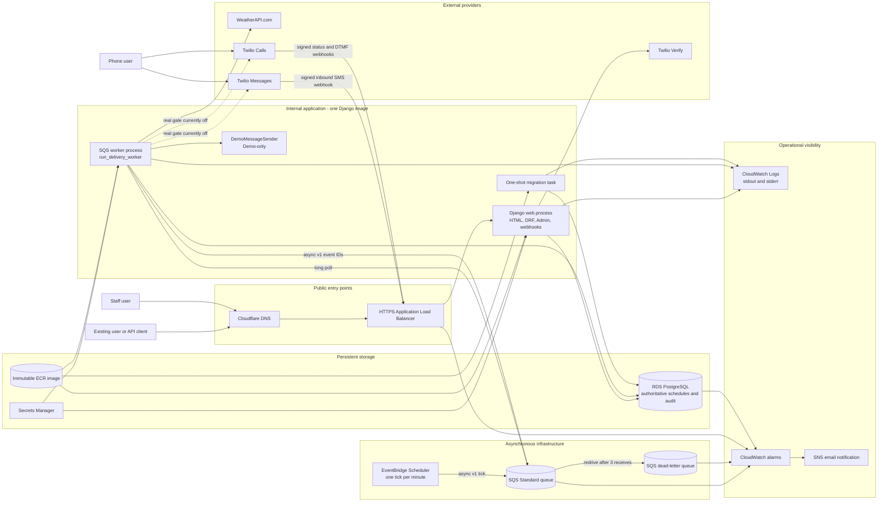

Normal requests enter through the ALB and Django web process. A minute tick is transported through SQS; the worker expands it into identifier-only messages, reloads PostgreSQL state, and performs delivery. Demo events take the same weather, rendering, and audit path but end at the logging-only sender. There is no cache or Redis broker: DRF throttling uses Django's current process-local cache, and SQS is the only implemented message broker.

Failure visibility is split between immutable database attempts, sanitized application logs, SQS redrive, and alarms. `submitted` means Twilio accepted creation, not final delivery.

Implementation references:

- `apps/delivery/services.py`
- `apps/delivery/queue_services.py`
- `config/settings/base.py`
- `infra/aws/phase8-queue.yaml`
- `infra/aws/phase10-application.yaml`
- `docs/deployment.md`
- Commit `b1d7d4f`: added the SQS worker and AWS application stacks
- Commit `0c00f59`: wired callback configuration into deployed tasks

### 2. Service responsibility map

Purpose: group implementation details into architectural responsibilities rather than class-by-class inventory.

Important assumptions: “service” means an internal responsibility boundary inside the Django monolith. Only web, worker, and migration are separately running processes.

Relevant sources: `docs/domain.md`, `apps/*/services.py`, `apps/delivery/gateways.py`, `apps/weather/providers.py`, and commit `139c02d`.

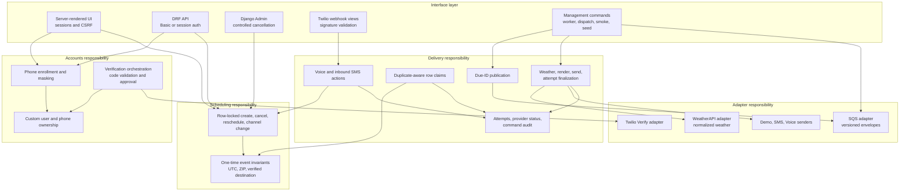

Views and commands translate transport concerns and delegate to application services. Models enforce local invariants and legal state changes. Adapters keep provider SDK objects and raw payloads outside the application boundary. Database transactions surround claims and finalization, but never long-running provider calls.

Implementation references:

- `apps/accounts/services.py`
- `apps/scheduling/services.py`
- `apps/delivery/services.py`
- `apps/delivery/queueing.py`
- `apps/weather/providers.py`
- `docs/architecture.md` section “Service Boundaries”
- Commit `139c02d`: introduced provider protocols and orchestration boundaries

### 3. Individual service diagrams

#### 3.1 Accounts and phone verification

Purpose: explain enrollment, ownership, validation, throttling, external verification, and local approval.

Important assumptions: verification is a real-provider workflow even when later event delivery is demo-only. DRF throttles are approximate and process-local.

Relevant sources: `apps/accounts/services.py`, `apps/accounts/views.py`, `apps/accounts/twilio_verify.py`, `apps/accounts/tests/test_api.py`, and commits `139c02d` and `daf2086`.

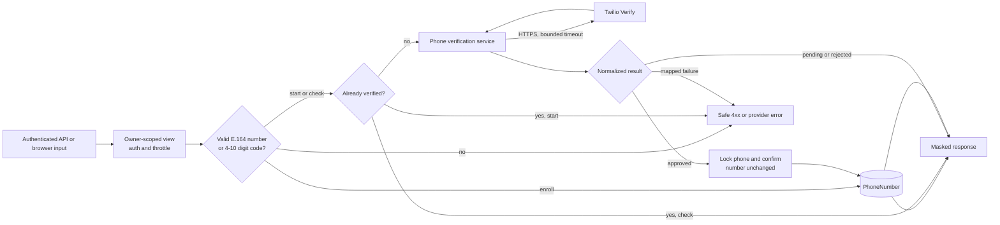

Twilio owns codes, expiry, and attempt counters; no OTP is stored. Approval is persisted only after a row lock verifies the destination did not change. Missing configuration and provider failures are mapped to project-owned exceptions and safe API/browser errors; there is no automatic application retry.

Implementation references:

- `apps/accounts/models.py`
- `apps/accounts/services.py`
- `apps/accounts/twilio_verify.py`
- `apps/accounts/tests/test_verification_services.py`
- `apps/accounts/tests/test_twilio_verify.py`
- `docs/domain.md` section “Verification workflow”

#### 3.2 Scheduling service

Purpose: show creation and pending-event mutations independently of delivery.

Important assumptions: all public creation is one-time and demo-only; explicit-offset input is normalized to UTC.

Relevant sources: `apps/scheduling/services.py`, `apps/scheduling/serializers.py`, `apps/scheduling/forms.py`, and commit `1890fca`.

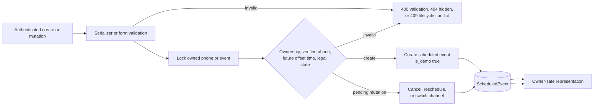

The scheduling service never calls weather, Twilio, or SQS and never creates a delivery attempt for a pending mutation. Locking the same event row used by delivery claims makes cancellation and edits serialize with workers.

Implementation references:

- `apps/scheduling/models.py`
- `apps/scheduling/services.py`
- `apps/scheduling/tests/test_api.py`
- `apps/scheduling/tests/test_services.py`
- `apps/delivery/tests/test_dispatch_concurrency.py`
- `docs/domain.md` section “ScheduledEvent”

#### 3.3 Due publication and queue worker

Purpose: explain the asynchronous boundary, strict messages, retry ownership, and acknowledgement behavior.

Important assumptions: SQS Standard is at-least-once. Tick expansion reads but does not claim events.

Relevant sources: `apps/delivery/queueing.py`, `apps/delivery/queue_services.py`, `apps/delivery/sqs.py`, `apps/delivery/management/commands/run_delivery_worker.py`, and commit `b1d7d4f`.

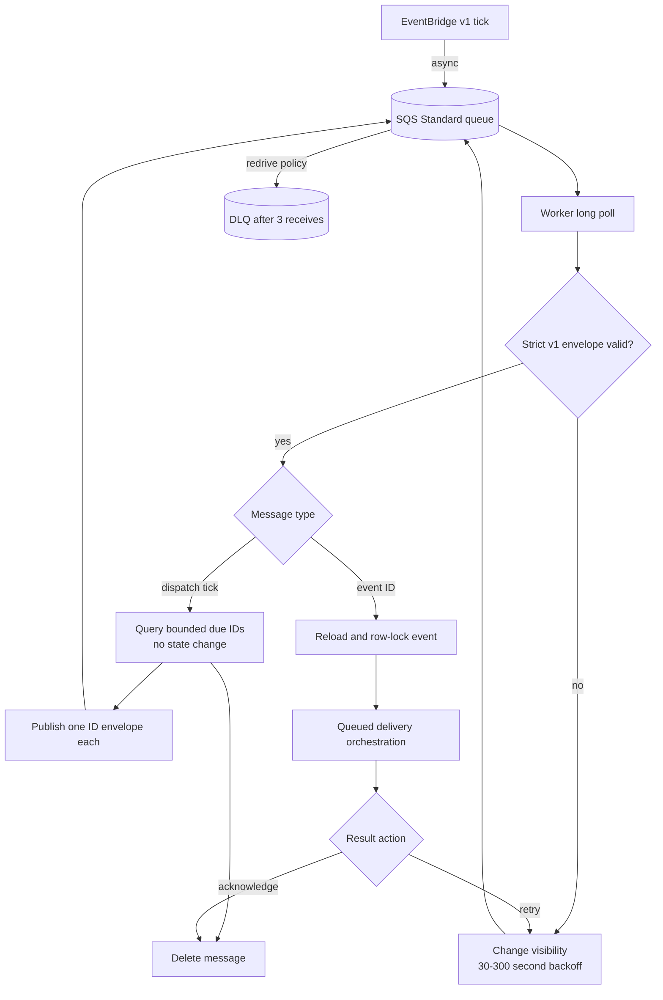

Ticks can be duplicated and partial ID publication can repeat earlier IDs; authoritative claiming makes this safe. Malformed messages, stale `processing` rows, and exhausted retryable failures remain for redrive. Queue adapter errors stop the command and are surfaced through process logs/alarms rather than a second internal retry loop; boto3 itself is configured for two standard attempts.

Implementation references:

- `apps/delivery/queueing.py`
- `apps/delivery/queue_services.py`
- `apps/delivery/sqs.py`
- `apps/delivery/tests/test_queue_services.py`
- `apps/delivery/tests/test_queueing.py`
- `infra/aws/phase8-queue.yaml`

#### 3.4 Delivery orchestration

Purpose: show the internal claim-execute-finalize split and every terminal output.

Important assumptions: network work occurs outside database transactions. The worker path has narrower retry behavior than the direct dispatcher.

Relevant sources: `apps/delivery/services.py`, `apps/delivery/gateways.py`, `apps/delivery/messages.py`, and tests in `apps/delivery/tests/test_services.py`.

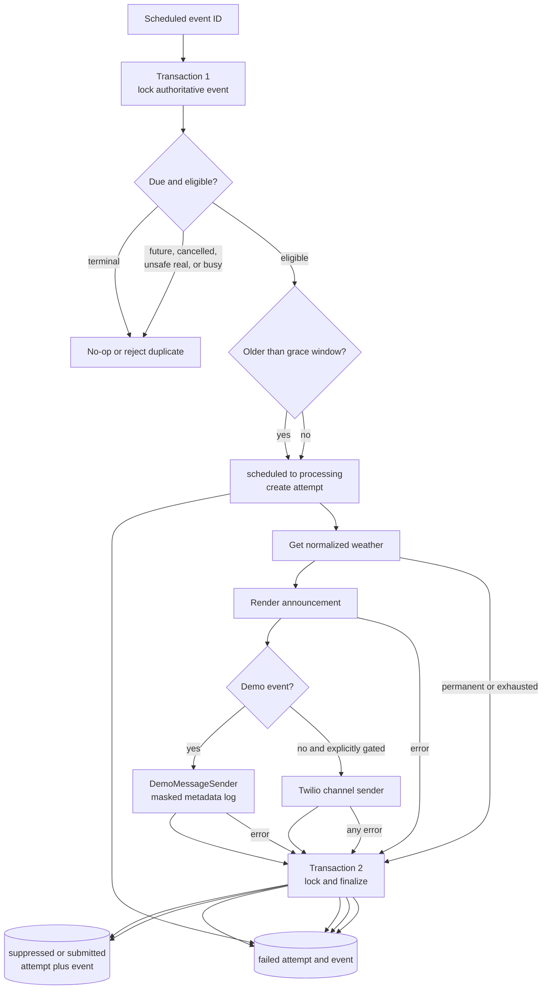

Every claimed execution gets an immutable attempt. Demo suppression happens only at the sender boundary after weather and rendering, preserving an audit. A real sender exception is terminal even if nominally retryable because provider acceptance may be hidden by a timeout.

Implementation references:

- `apps/delivery/services.py`
- `apps/delivery/models.py`
- `apps/delivery/tests/test_services.py`
- `apps/delivery/tests/test_queue_services.py`
- `apps/delivery/tests/test_dispatch_concurrency.py`
- `docs/domain.md` sections “Demo Delivery Invariant” and “Idempotency and Concurrency”

#### 3.5 Weather service

Purpose: show provider normalization, timeout behavior, error mapping, and the deterministic fallback used by local/demo commands.

Important assumptions: `FakeWeatherProvider` is explicitly injected; it is not an automatic fallback when WeatherAPI fails in the deployed worker.

Relevant sources: `apps/weather/providers.py`, `apps/weather/weatherapi.py`, `apps/weather/tests/test_weatherapi.py`, and commit `139c02d`.

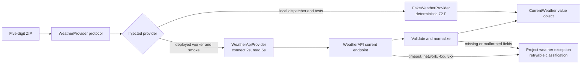

The application consumes only `CurrentWeather`; vendor JSON stays in the adapter. Timeouts, availability, and rate limits are retryable on the queue path. Invalid ZIP, credentials, and malformed data are permanent. The direct dispatcher records all provider failures terminally.

Implementation references:

- `apps/weather/providers.py`
- `apps/weather/weatherapi.py`
- `apps/weather/exceptions.py`
- `apps/weather/tests/test_weatherapi.py`
- `apps/delivery/management/commands/dispatch_due_events.py`

#### 3.6 Messaging and interaction service

Purpose: show channel routing, demo safety, Twilio submission, and signed callback processing.

Important assumptions: only Voice has provider-status callbacks. No outbound SMS delivery-status callback exists.

Relevant sources: `apps/delivery/twilio_sender.py`, `apps/delivery/twilio_sms.py`, `apps/delivery/twilio_voice.py`, `apps/delivery/twilio_webhooks.py`, `apps/delivery/views.py`, and commits `9d12caf`, `5a370f8`, and `2a4f1c6`.

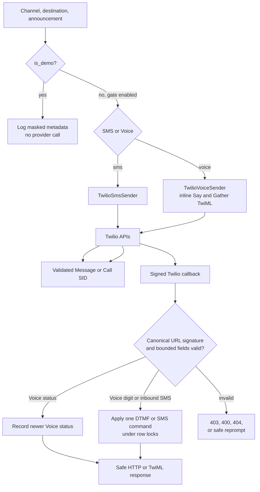

Adapters validate E.164 input, message length, HTTPS callback URLs, bounded timeouts, and returned SID shapes. Signed callbacks infer ownership from a stored Call SID or exact verified sender; they never accept a user or target event ID. Duplicate Voice actions and inbound Message SIDs return the first stored result.

Implementation references:

- `apps/delivery/twilio_sms.py`
- `apps/delivery/twilio_voice.py`
- `apps/delivery/twilio_webhooks.py`
- `apps/delivery/views.py`
- `apps/delivery/tests/test_voice_status_webhook.py`
- `apps/delivery/tests/test_voice_action_webhook.py`
- `apps/delivery/tests/test_inbound_sms_webhook.py`

### 4. Primary end-to-end workflow

Purpose: trace a successful API-created demo event from phone ownership through asynchronous suppression and user-visible status.

Important assumptions: the user already exists because registration is not implemented. Verification is real unless tests inject a fake gateway. The event is made due before the scheduler tick.

Relevant sources: `apps/accounts/views.py`, `apps/scheduling/views.py`, `apps/delivery/queue_services.py`, `apps/delivery/services.py`, `docs/demo.md`, and commits `1890fca`, `daf2086`, and `b1d7d4f`.

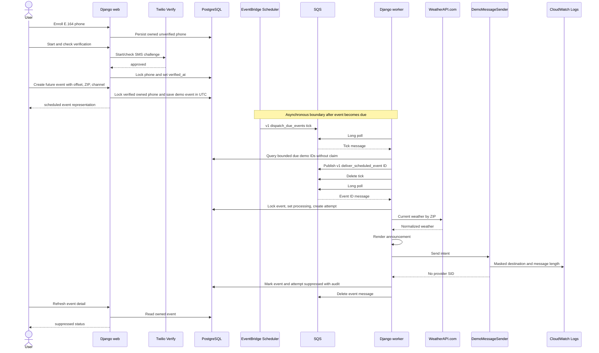

The synchronous user request ends after persistence; delivery is asynchronous. User-facing views expose lifecycle state but omit the attempt's message, weather snapshot, and provider fields. Staff can inspect that audit in Admin. A real queued event would remain untouched while the real-delivery gate is off.

Implementation references:

- `apps/accounts/views.py`
- `apps/scheduling/views.py`
- `apps/scheduling/services.py`
- `apps/delivery/queue_services.py`
- `apps/delivery/services.py`
- `apps/delivery/tests/test_queue_services.py`
- `docs/demo.md`

### 5. Scheduling and background-processing workflow

Purpose: detail persistence, discovery, claims, duplicates, retries, restarts, and Docker/AWS process participation.

Important assumptions: PostgreSQL locking guarantees apply in production; SQLite tests cover functional behavior but not row-lock concurrency.

Relevant sources: `apps/delivery/services.py`, `apps/delivery/queue_services.py`, `apps/delivery/tests/test_dispatch_concurrency.py`, `infra/aws/phase8-queue.yaml`, and `infra/aws/phase10-application.yaml`.

```mermaid
sequenceDiagram
    actor Client
    participant Web as Web container/task
    participant DB as PostgreSQL
    participant Tick as EventBridge Scheduler
    participant Q as SQS and DLQ
    participant Worker as Worker task
    participant Provider as Weather and sender boundaries

    Client->>Web: Submit explicit-offset future event
    Web->>DB: Store scheduled_for in UTC and status scheduled
    Tick->>Q: Tick every minute
    Worker->>Q: Receive tick at least once
    Worker->>DB: Select oldest due scheduled IDs, bounded batch
    Note over Worker,DB: No claim and no state change during publication
    loop Each due ID
        Worker->>Q: Publish identifier-only message
    end
    Worker->>Q: Acknowledge tick

    Worker->>Q: Receive event ID with receive count
    Worker->>DB: SELECT FOR UPDATE authoritative event
    alt already terminal or cancelled
        DB-->>Worker: Safe no-op
        Worker->>Q: Acknowledge duplicate
    else stale processing without retry marker
        DB-->>Worker: Quarantined state
        Worker->>Q: Retain with visibility delay
    else eligible and within grace
        Worker->>DB: processing plus new attempt, then commit
        Worker->>Provider: Calls outside transaction
        alt success or demo suppression
            Worker->>DB: Finalize submitted or suppressed
            Worker->>Q: Acknowledge
        else retryable pre-sender failure and receive below 3
            Worker->>DB: Fail attempt; event remains processing
            Worker->>Q: Visibility backoff, then retry
        else retry exhausted
            Worker->>DB: Fail event with RetryExhausted code
            Worker->>Q: Retain for DLQ redrive
        else permanent or any sender-boundary failure
            Worker->>DB: Fail event and attempt
            Worker->>Q: Acknowledge
        end
    else outside 15-minute grace
        Worker->>DB: Record MissedDeliveryWindow failure
        Worker->>Q: Acknowledge
    end

    Note over Q,Worker: After a process restart, undeleted messages reappear; database state remains authoritative
```

The AWS worker is a long-running Fargate service. Local Compose does not define a worker or scheduler container; operators can run the same management commands manually against configured SQS. A crash before acknowledgement causes redelivery. A crash after Twilio acceptance but before SID persistence is deliberately not made exactly-once and may leave a quarantined `processing` event.

Implementation references:

- `apps/delivery/management/commands/run_delivery_worker.py`
- `apps/delivery/queue_services.py`
- `apps/delivery/services.py`
- `apps/delivery/tests/test_queue_services.py`
- `apps/delivery/tests/test_dispatch_concurrency.py`
- `infra/aws/phase8-queue.yaml`
- `docs/domain.md` section “Idempotency and Concurrency”

### 6. External integration workflows

#### 6.1 WeatherAPI.com

Purpose: isolate the required deployed weather integration and its normalization/failure contract.

Important assumptions: WeatherAPI is required for deployed queued delivery; there is no automatic provider failover or weather cache.

Relevant sources: `apps/weather/weatherapi.py`, `apps/weather/exceptions.py`, and `apps/weather/tests/test_weatherapi.py`.

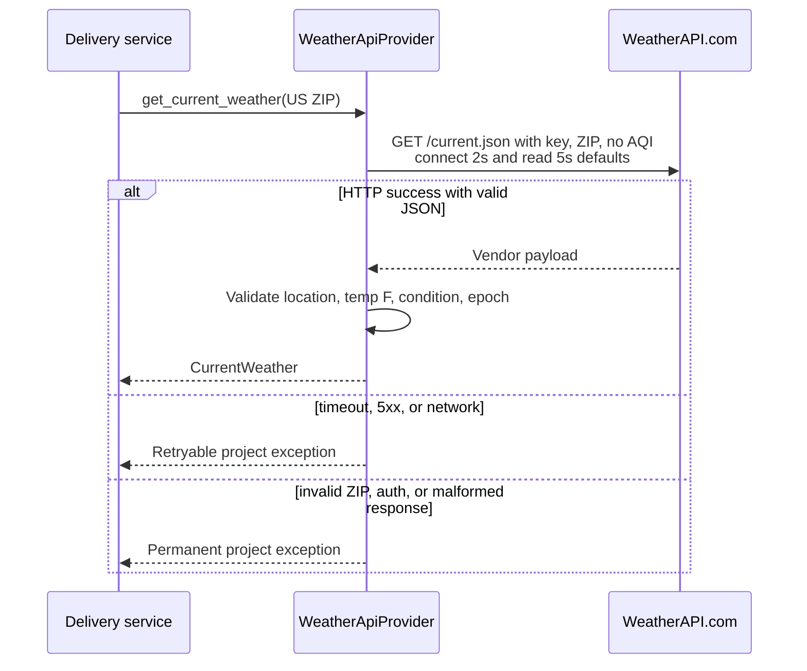

Provider credentials and raw JSON remain inside the adapter. Fake weather is available only through explicit dependency injection for deterministic commands/tests.

Implementation references:

- `apps/weather/weatherapi.py`
- `apps/weather/providers.py`
- `apps/weather/tests/test_weatherapi.py`
- Commit `139c02d`: added the normalized WeatherAPI boundary

#### 6.2 Twilio Verify

Purpose: show the optional-at-enrollment but required-for-real-ownership verification integration.

Important assumptions: users cannot schedule against an unverified phone. Twilio owns OTP state and the application stores no code.

Relevant sources: `apps/accounts/twilio_verify.py`, `apps/accounts/services.py`, and `apps/accounts/tests/test_twilio_verify.py`.

```mermaid
sequenceDiagram
    actor User
    participant App as Accounts service
    participant Verify as Twilio Verify
    participant DB as PostgreSQL

    User->>App: Start verification for owned phone
    App->>Verify: Create SMS challenge with bounded timeout
    Verify-->>App: pending or mapped error
    User->>App: Check 4-10 digit code
    App->>Verify: Verification check
    alt approved
        App->>DB: Lock phone, confirm unchanged, set verified_at
        App-->>User: approved with masked phone
    else pending or rejected
        App-->>User: normalized status; remain unverified
    else provider failure
        App-->>User: safe mapped error; no retry
    end
```

Provider SIDs do not appear in API responses. Rate limiting exists both as approximate DRF throttle scopes and as mapped Twilio errors.

Implementation references:

- `apps/accounts/services.py`
- `apps/accounts/twilio_verify.py`
- `apps/accounts/tests/test_api.py`
- `docs/domain.md` section “PhoneNumber”

#### 6.3 Twilio SMS and Voice submission

Purpose: compare real provider submission with the demo-only sender and clarify callback differences.

Important assumptions: automatic real worker delivery needs both the infrastructure environment gate and worker command flag. SMS final-delivery callbacks are not implemented.

Relevant sources: `apps/delivery/twilio_sms.py`, `apps/delivery/twilio_voice.py`, `apps/delivery/gateways.py`, and `apps/delivery/tests/test_twilio_sms.py`.

```mermaid
sequenceDiagram
    participant Delivery as Delivery service
    participant Router as MessageSender router
    participant Demo as DemoMessageSender
    participant Twilio as Twilio SMS or Calls API
    participant Webhook as Django callback views

    alt demo event
        Delivery->>Demo: channel, destination, message
        Demo-->>Delivery: no provider SID
        Note over Demo: Logs masked number and length only
    else explicitly enabled real SMS
        Delivery->>Router: SMS intent
        Router->>Twilio: Messages.create with bounded timeout
        Twilio-->>Router: validated SM or MM SID
        Router-->>Delivery: DeliveryResult
        Note over Delivery: Local status submitted; no SMS status callback
    else explicitly enabled real Voice
        Delivery->>Router: Voice intent
        Router->>Twilio: Calls.create with inline Say/Gather TwiML<br/>and status callback
        Twilio-->>Router: validated CA SID
        Router-->>Delivery: DeliveryResult
        Twilio->>Webhook: Signed status and DTMF callbacks
    end
```

Configuration, request, rejection, rate-limit, timeout, availability, and malformed-response errors are mapped into project exceptions. All errors after entering the sender boundary are terminal in the worker because a timeout can hide successful provider acceptance. Physical SMS remains externally limited by A2P campaign approval.

Implementation references:

- `apps/delivery/gateways.py`
- `apps/delivery/twilio_sender.py`
- `apps/delivery/twilio_sms.py`
- `apps/delivery/twilio_voice.py`
- `apps/delivery/tests/test_twilio_voice.py`
- `docs/handoff.md` section “Known Gaps”

#### 6.4 Twilio inbound callbacks

Purpose: show provider authentication, trusted ownership derivation, idempotency, and bounded control behavior.

Important assumptions: callback URLs must exactly match the canonical HTTPS URLs used for signature validation. Live callback smokes remain unperformed.

Relevant sources: `apps/delivery/twilio_webhooks.py`, `apps/delivery/views.py`, `apps/delivery/services.py`, and commits `5a370f8`, `2a4f1c6`, and `0c00f59`.

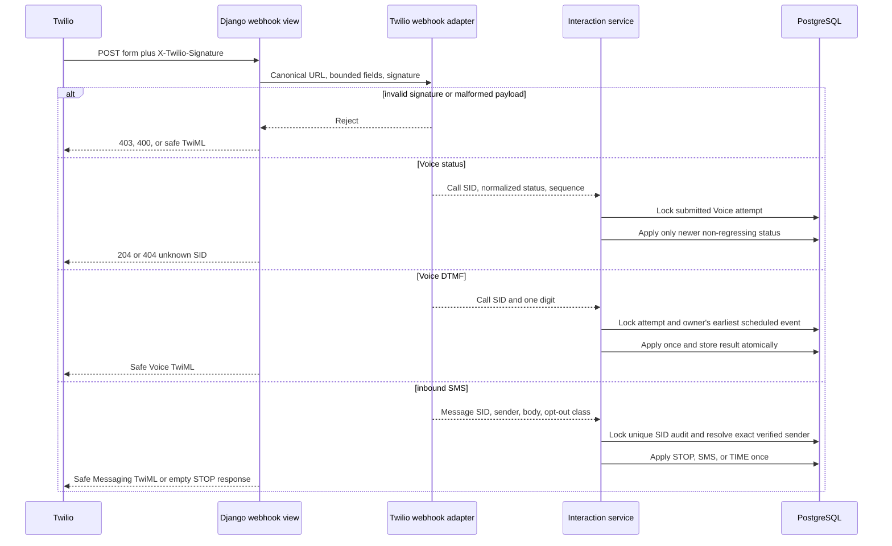

Full inbound numbers and bodies are processed transiently but never stored or logged. Unknown and unverified senders get the same safe result. Twilio Advanced Opt-Out remains the carrier-compliance authority; local `STOP` only cancels one event.

Implementation references:

- `apps/delivery/twilio_webhooks.py`
- `apps/delivery/views.py`
- `apps/delivery/services.py`
- `apps/delivery/tests/test_inbound_sms_webhook.py`
- `apps/delivery/tests/test_voice_action_concurrency.py`
- `apps/delivery/tests/test_inbound_sms_concurrency.py`

### 7. Data model and persistence

Purpose: show durable entities, ownership, event state, attempt history, provider audit, and command idempotency without reproducing every column.

Important assumptions: `voice_action_target_event_id` and `InboundSmsCommand.target_event_id` are audit identifiers, not database foreign keys. Weather is a normalized JSON snapshot on each attempt, not a separate table.

Relevant sources: `apps/accounts/models.py`, `apps/scheduling/models.py`, `apps/delivery/models.py`, migrations, and `docs/domain.md`.

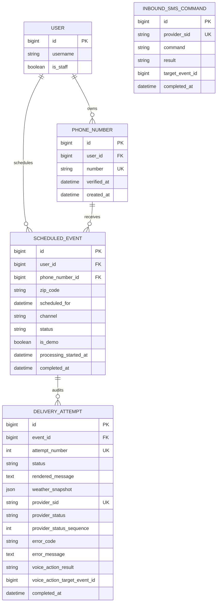

An event protects its phone destination from deletion and owns one or more immutable attempts. The `(event, attempt_number)` constraint orders retries. Provider SIDs are unique where present, and inbound SMS Message SID uniqueness supplies callback idempotency. OTPs, queue messages, raw provider payloads, and application logs are not persisted in these models.

Implementation references:

- `apps/accounts/models.py`
- `apps/scheduling/models.py`
- `apps/delivery/models.py`
- `apps/delivery/migrations/0004_inboundsmscommand.py`
- `apps/delivery/tests/test_models.py`
- `docs/domain.md`

### 8. State lifecycle

Purpose: show only implemented `ScheduledEvent` states and legal transitions, including retry behavior that does not add a new event state.

Important assumptions: “retrying” is represented by `processing` plus a failed attempt whose error begins `QueueRetryable:`; it is not a separate event status. `submitted` is provider acceptance.

Relevant sources: `apps/scheduling/models.py`, `apps/delivery/services.py`, `apps/delivery/tests/test_models.py`, and `docs/domain.md`.

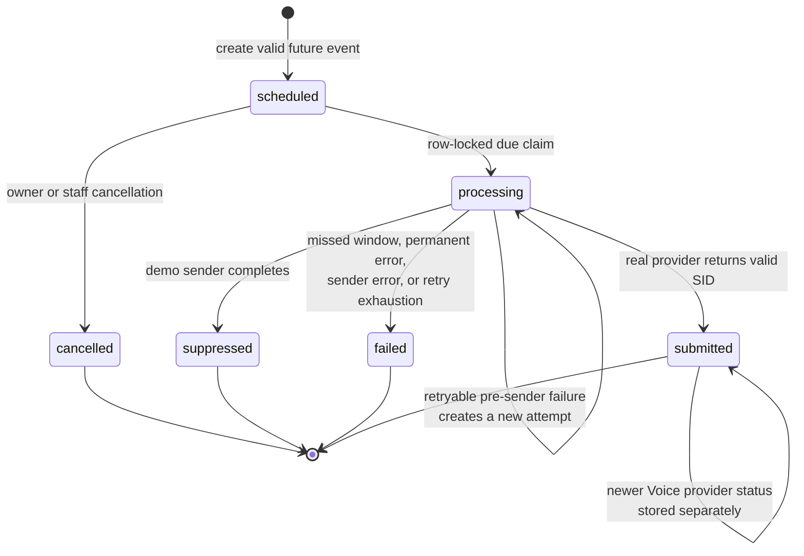

Rescheduling and channel switching are legal only in `scheduled` and do not change state. Terminal events are duplicate-safe no-ops for queued delivery. A stale `processing` event is quarantined rather than automatically failed or replayed.

Implementation references:

- `apps/scheduling/models.py`
- `apps/delivery/models.py`
- `apps/delivery/services.py`
- `apps/delivery/tests/test_services.py`
- `apps/delivery/tests/test_queue_services.py`
- `docs/domain.md` section “Event state machine”

### 9. Failure and fallback behavior

Purpose: consolidate validation, configuration, provider, worker, database, duplicate, demo, and known-ambiguity outcomes.

Important assumptions: a database outage is not specially recovered inside application code; the process/command fails and ECS/SQS provide restart/redelivery behavior. “Fallback” means an explicitly selected fake/demo adapter, never silent fallback from a real provider.

Relevant sources: project exception modules, `apps/delivery/services.py`, `apps/delivery/queue_services.py`, tests, `docs/domain.md`, and `docs/handoff.md`.

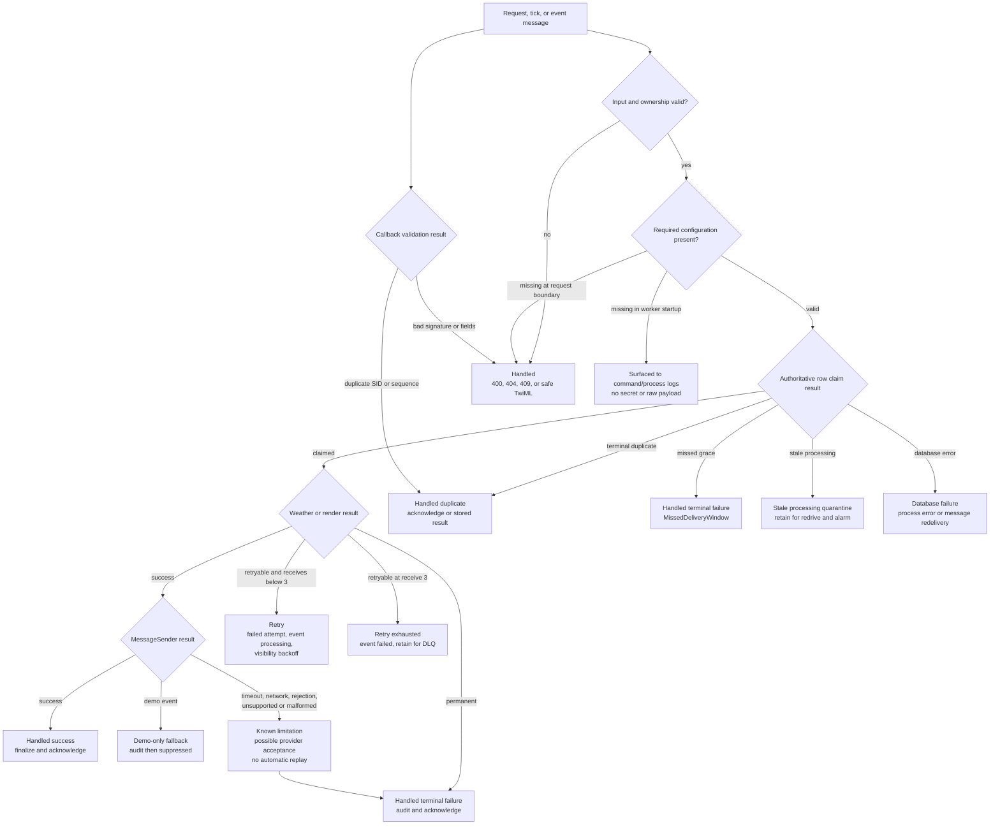

Invalid user input is rejected before provider calls where possible. Queue retry is bounded to retryable pre-sender failures. The direct dispatcher has no automatic retry. Malformed queue messages and retry exhaustion are retained for DLQ redrive; permanent local failures and all sender failures are audited and acknowledged. There is no exactly-once guarantee, provider reconciliation, automatic stale-claim recovery, weather failover, or SMS delivery-status callback.

Implementation references:

- `apps/weather/exceptions.py`
- `apps/accounts/verification_exceptions.py`
- `apps/delivery/exceptions.py`
- `apps/delivery/services.py`
- `apps/delivery/queue_services.py`
- `apps/delivery/tests/test_queue_services.py`
- `apps/delivery/tests/test_dispatch_concurrency.py`
- `docs/handoff.md` section “Known Gaps”

### 10. Deployment and runtime topology

Purpose: distinguish the small local Compose environment from the deployed AWS staging topology, including ports, networks, volumes, configuration, and observability.

Important assumptions: Cloudflare currently provides public DNS even though the template supports optional Route 53. Web and worker each run at desired count one in staging; template defaults are zero and the scheduler default is disabled.

Relevant sources: `Dockerfile`, `docker-compose.yml`, `.env.example`, all three `infra/aws` templates, `docs/deployment.md`, and commits `b1d7d4f`, `0c00f59`, and `003844a`.

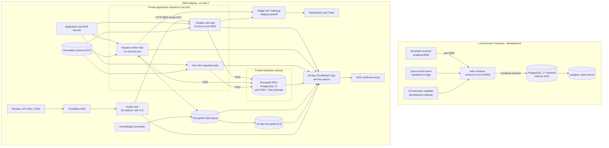

Local Compose intentionally has no worker, scheduler, SQS, or provider emulator; those commands can be launched manually if external configuration is supplied. AWS uses one immutable image with three task definitions, separate task roles, private tasks without public IPs, and an internet-facing ALB as the only inbound path. Configuration is split between non-secret task environment variables and Secrets Manager JSON keys.

The single NAT Gateway and non-Multi-AZ RDS defaults are explicit staging limitations. The templates create billable resources, retain important logs/secrets/images, and require a deliberate scale-to-zero or teardown decision.

Implementation references:

- `Dockerfile`
- `docker-compose.yml`
- `.env.example`
- `infra/aws/phase10-ecr.yaml`
- `infra/aws/phase8-queue.yaml`
- `infra/aws/phase10-application.yaml`
- `tests/test_aws_templates.py`
- `tests/test_production_settings.py`
- `docs/deployment.md`
- Commit `003844a`: added production static-file serving and reviewer demo documentation

## Diagram-wide limitations and traceability notes

- **Implemented:** owner-scoped API/browser workflows, Twilio Verify, demo suppression, WeatherAPI, Twilio SMS/Voice submission, Voice callbacks, inbound SMS controls, bounded SQS processing, AWS staging infrastructure, database and log auditing.
- **Demo-only by default:** browser/API-created events and automatic queued processing. Real queue delivery requires two explicit gates; isolated real-provider smoke commands have separate destination and confirmation gates.
- **External limitation:** Twilio accepted live SMS submissions, but physical US delivery remains blocked by A2P campaign registration. A valid SID proves submission only.
- **Documented but not implemented:** public registration, token issuance, recurring events, user time zones, SMS delivery-status callbacks, weather cache/failover, transactional outbox, stale-processing reconciliation, OpenTelemetry, and exactly-once provider delivery.
- **Unclear from live evidence:** deterministic tests cover signed inbound SMS, Voice status, and Voice DTMF callbacks, but the repository records no live callback smoke. The diagrams therefore describe implemented code, not confirmed end-to-end provider callback operation.
